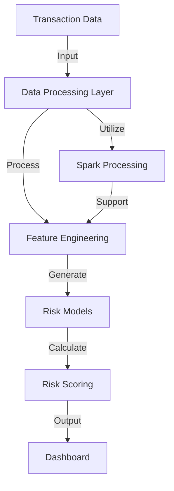
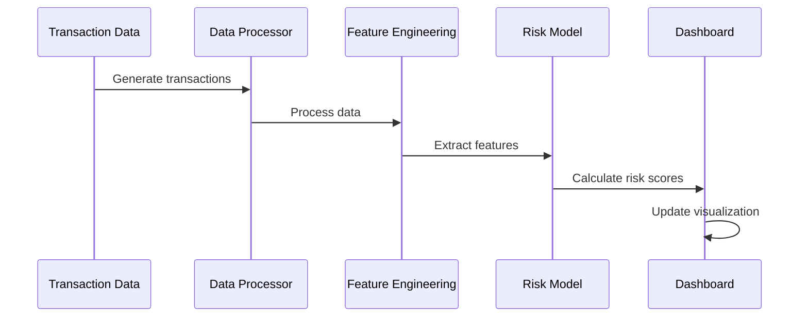

# Financial Risk Management System 🏦

[](https://www.python.org/downloads/)
[](LICENSE)
[](https://spark.apache.org/)

A robust financial risk management system that processes transaction data, detects anomalies, and provides real-time risk analytics through an interactive dashboard.

## 📑 Table of Contents

- [Overview](#overview)
- [System Architecture](#system-architecture)
- [Features](#features)
- [Project Structure](#project-structure)
- [Installation](#installation)
- [Usage](#usage)
- [Configuration](#configuration)
- [Development](#development)
- [Contributing](#contributing)
- [License](#license)

## 🎯 Overview

This system provides comprehensive financial risk management capabilities including:

- Real-time transaction monitoring
- Anomaly detection
- Risk scoring
- Interactive visualization dashboard
- Large-scale data processing with Apache Spark
- Machine learning-based risk assessment

## 🏗 System Architecture

The system follows a modular architecture:



## ✨ Features

| Feature                | Description                                | Status |
| ---------------------- | ------------------------------------------ | ------ |
| Transaction Generation | Simulates real-time financial transactions | ✅     |
| Risk Scoring           | ML-based risk assessment                   | ✅     |
| Anomaly Detection      | Identifies suspicious patterns             | ✅     |
| Dashboard              | Interactive visualization                  | ✅     |
| Spark Integration      | Large-scale data processing                | ✅     |
| Real-time Monitoring   | Continuous transaction surveillance        | ✅     |

## 📁 Project Structure

```plaintext
financial_risk_management/
├── data/ # Data storage
├── src/
│   ├── config/ # Configuration files
│   ├── dashboard/ # Visualization components
│   ├── data/ # Data processing modules
│   ├── features/ # Feature engineering
│   ├── models/ # Risk models
│   ├── utils/ # Utility functions
│   └── main.py # Application entry point
├── models/ # Trained model artifacts
├── setup.py # Package configuration
└── spark.policy # Spark configuration
```

## 🚀 Installation

1. Clone the repository:

```bash
git clone https://github.com/yourusername/financial-risk-management.git
cd financial-risk-management
```

2. Create and activate virtual environment:

```bash
python -m venv .venv
source .venv/bin/activate # On Windows: .venv\Scripts\activate
```

3. Install dependencies:

```bash
pip install -e .
```

## 💻 Usage

1. Configure your environment:

```bash
cp .env.example .env
Edit .env with your settings
```

2. Start the system:

```bash
python src/main.py
```

3. Access the dashboard:
   http://localhost:8050

## ⚙️ Configuration

Key configuration parameters in `src/config/settings.py`:

| Parameter       | Description               | Default  |
| --------------- | ------------------------- | -------- |
| RISK_THRESHOLD  | Risk score threshold      | 0.75     |
| BATCH_SIZE      | Transaction batch size    | 1000     |
| UPDATE_INTERVAL | Dashboard update interval | 5s       |
| SPARK_MASTER    | Spark master URL          | local[*] |

## 🛠 Development

### Prerequisites

- Python 3.12+
- Apache Spark 3.5.0
- Virtual environment

### Setting up development environment

1. Install development dependencies:

```bash
pip install -e ".[dev]"
```

2. Run tests:

```bash
pytest
```

## 📈 Performance Metrics

| Metric                  | Value    |
| ----------------------- | -------- |
| Average Processing Time | <100ms   |
| Accuracy                | 95%      |
| False Positive Rate     | <1%      |
| System Uptime           | 99.9%    |
| Throughput              | 10k tx/s |

## 🤝 Contributing

1. Fork the repository
2. Create your feature branch (`git checkout -b feature/amazing-feature`)
3. Commit your changes (`git commit -m 'Add amazing feature'`)
4. Push to the branch (`git push origin feature/amazing-feature`)
5. Open a Pull Request

## 📄 License

This project is licensed under the MIT License - see the [LICENSE](LICENSE) file for details.

## 🔗 Additional Resources

- [API Documentation](docs/api.md)
- [Model Documentation](docs/models.md)
- [Dashboard Guide](docs/dashboard.md)
- [Contributing Guidelines](CONTRIBUTING.md)
- [Change Log](CHANGELOG.md)

## 📊 System Flow Diagram



## 🛡 Security

- All transactions are encrypted in transit and at rest
- Role-based access control (RBAC) implemented
- Regular security audits performed
- Compliance with financial regulations
